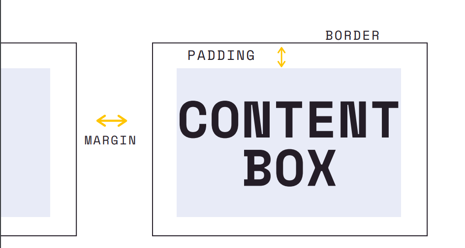

# 1. 色に関するプロパティ
### 1-1. color
- 文字色の設定
- 要素のテキストやテキスト装飾における色の値を設定することができる
- 色の設定は、色の名称や16進数での指定、rgbでの設定など色々な設定の方法がある
  
### 1-2. background-color
- 背景色の設定
- 色の設定は、色の名称や16進数での指定、rgbでの設定など色々な設定の方法がある
  
### 1-3. background
- `background-color`より、より緻密な背景色の設定ができる
- グラデーションや、画像の背景の変更など変更できる
  
   
  
# 2. テキストに関するプロパティ
### 2-1. text-align
- ブロック要素単位で配置する位置を水平方向で設定できるプロパティ
- 通常テキストはデフォルトで**左寄せ**になっているため、テキストを中央に寄せたりしたいときに指定する
- リファレンス：[text-align -MDN](https://developer.mozilla.org/ja/docs/Web/CSS/text-align)  
    
### 2-2. font-weight
- 文字の太さの指定
- サポートされていないフォントなども存在するので適用されない場合もある
- サポートされていないときは、指定値に限りなく近いものが適用されることがある
- リファレンス：[font-weight -MDN](https://developer.mozilla.org/ja/docs/Web/CSS/font-weight)  
  
### 2-3. text-decoration
- テキストに装飾的な線、**アンダーライン**や**オーバーライン**、**打消し線**を付けることができる
- `text-decoration`はその他`text-decoration-line`や`text-decoration-color`、`text-decoration-sytle`などを一括で指定できるプロパティになっており、色や線のスタイルなどをひとつのプロパティで設定できる
- 反対に`<a>`要素などのデフォルトで線が付いてしまう要素から線を無くす指定などもできる
- リファレンス：[text-decoration -MDN](https://developer.mozilla.org/ja/docs/Web/CSS/text-decoration)  
  
### 2-4. line-height
- 行の高さを設定するプロパティ
- 設定する数値は、自分の現在のフォントサイズから何倍にするかを指定し、例えば`2`にすれば2倍の行の高さになるし、`0.5`とすれば自分のフォントサイズの半分の高さになる  
- リファレンス：[line-height -MDN](https://developer.mozilla.org/ja/docs/Web/CSS/line-height)
  
### 2-5. letter-spacing
- 文字と文字の間隔を設定できるプロパティ
- 色々な単位で指定できるが、`px`で指定するのが分かり易い
- リファレンス：[letter-spacing -MDN](https://developer.mozilla.org/ja/docs/Web/CSS/letter-spacing)  

### 2-6. text-transform
- テキストを全て大文字にしたり、小文字にしたり、単語の先頭を大文字にしたりなどを設定できるプロパティ
- リファレンス：[text-transform -MDN](https://developer.mozilla.org/ja/docs/Web/CSS/text-transform)  
  
   
  
# 3. フォントサイズに関するプロパティ
### 3-1. font-size
- テキストのフォントのサイズを設定できるプロパティ
- サイズの単位は色々あるが、`px`で指定するのが分かり易い
- リファレンス：[font-size -MDN](https://developer.mozilla.org/ja/docs/Web/CSS/font-size)
  
### 3-2. font-family
- フォントを設定できるプロパティ
- 値にフォント名を指定すれば、指定したフォント名が表示されるのが基本系
- ただし、指定したフォント名をブラウザがサポートしていない場合、うまく表示されないことがあるので注意
- ブラウザがデフォルト使えるフォント数は実は多くなく、OSにインストールされているフォントを読み込むという設定だったりもするので、デフォルトで使えるフォントは何かを確認するのに[CSS Fonts](https://www.cssfontstack.com/)などのサイトを参照しながら設定していくのが良い
- `font-family`は、**カンマ区切りで複数設定することが可能**で、バックアップ的に**いくつか設定**しておくのがベストプラクティスとされている
- バックアップとしての考え方としては、**総称ファミリー名**を設定することもベストプラクティスされている
  - 総称ファミリー名とは、そもそもフォント名は必ずどこかのフォントグループに所属しており、グループは複数のフォントから成り立っている。そのグループ名の事を総称ファミリー名という
  - 総称ファミリー名を指定することで、そのグループに所属するブラウザが使用できるフォントを適当に選択してくれるので、ある程度柔軟なフォント指定をすることが出来る
  
   
  
# 4. ボックスモデルに関するプロパティ
- HTML要素は全てボックスという形で扱われており、そのボックスをサイズなどのことをボックスモデルと呼ぶ
- ボックスモデルは以下のようないくつかのボックスが組み合わさって出来る大きな枠組みであり、それぞれのボックスを調整することで、本来の要素のレイアウトを整える重要な役割を持っている
  - content box：一番内側にある、テキストやイメージそのものの部分
  - padding：centent boxとborderの間にある、境界線の範囲部分
  - border：一番外側にある、ボックスの輪郭となる部分
  - margin：隣り合うボックスとの間隔を決める部分  
  
  

  
### 4.1 width
- 

<!-- 定型表現（コピーして使う）- リファレンス：[ -MDN]() -->